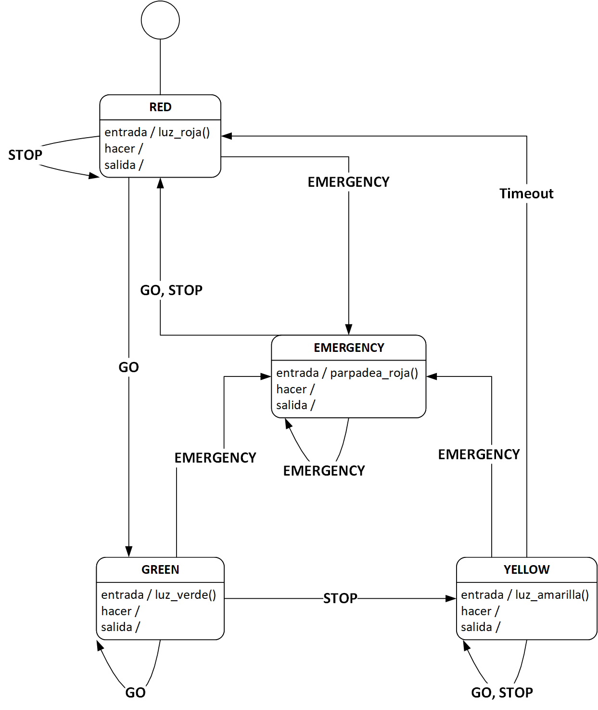

This is a simple scheduler, the next part of the finite state machine repository
Here we simulate the same project but in a time based event.


*Fuente: Making Embedded Systems. Elicia White. (2011)*

El programa usa la técnica *Time Based Events* para implementar el timeout del estado YELLOW (Capt. 5, pág. 141, Making Embedded Systems). Además, para emular eventos asincrónicos, el programa usa señales UNIX para la recepción de los comandos externos *GO*, *STOP*, *EMERGENCY*:

| Señal   | Comando   | Código señal |
|---------|-----------|--------------|
| SIGUSR1 | GO        | 10           |
| SIGUSR2 | STOP      | 12           |
| SIGINT  | EMERGENCY | 2 (Ctrl-C)   |

Para poder enviar una señal al programa, es necesario, en una segunda consola usar el comando *pkill* o *kill*. Para inciar el programa:

```
$ ./programa 
Programa iniciado, PID: 4925
[▆][ ][ ]
```
Para enviar el comando *GO* usar:
```
$ pkill -SIGUSR1 programa
```
o usando *kill*:
```
$ kill -SIGUSR1 4925
```

## Planificador simple

1.  Remover el código de timeout del estado YELLOW y reemplazarlo por una tarea no periodica la cual debe disparar el evento TIMER_TIMEOUT.
2. Entrar al estado EMERGENCY con SIGINT (Ctrl-C) y agendar una tarea periodica para parpadear la luz roja del semáforo.
3. Salir del estado EMERGENCY al recibir el comando *GO* o *STOP*.

El semáforo debe tener ahora el siguiente comportamiento:



Se ha proporcionado código semilla en [planificador.c](planificador.c) y [planificador.h](planificador.h), buscar los comentarios *TODO* en ambos archivos y en *main.c* para completar la implementación del planificador.

## Compilación y Ejecución
Para compilar el programa:
```
$ make
```
Para ejecutar el programa:
```
$ make run
```
o
```
$ ./programa
```
